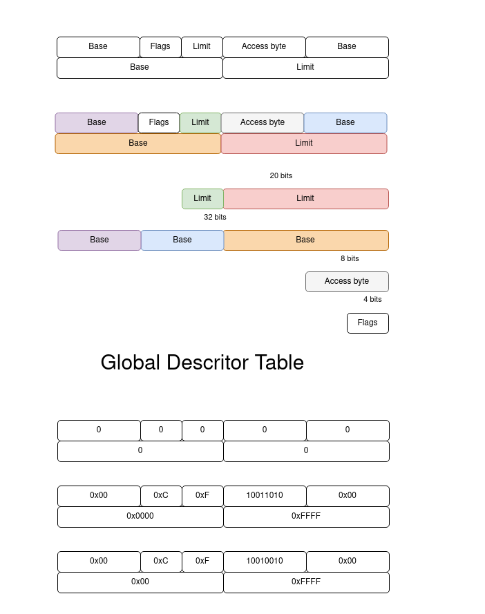

# cezos
My version of monolithic kernel.

# Global Descriptor table
One of my challenges was to understand the purpose of the GLOBAL DESCRIPTOR TABLE. I made the image below to illustrate what is GDT or what is a segment selector/segment descripor.`

The GDT is used for two primary purposes:

    Memory protection - The GDT provides hardware memory protection by ensuring that memory accesses fall within the bounds of the defined segments. It does this by comparing the segment's limit and base address with the address being accessed. If the access falls outside the segment, a segmentation fault is generated.

    Memory segmentation - The GDT allows the memory of a system to be divided into multiple segments, each with its own access permissions. This allows different parts of the system to have different levels of privilege and protection. For example, the operating system may have a separate code segment with higher privileges than user applications.

